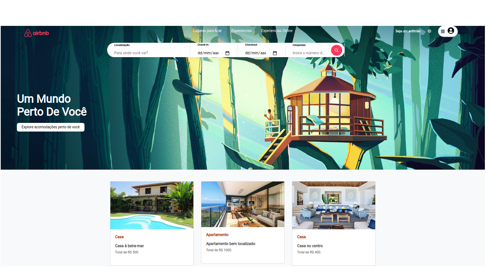

# AIRBNB CLONE PROJETO GAMA ACADEMY

criar uma página similar a do Airbnb através do consumo da API de quartos, usando Javascript Vanilla e Flexbox para organizá-los em cards na tela, a partir de banco de dados Json.

Resultados esperados:

Tela com cards contendo:
Imagem
Tipo de propriedade
Preço

